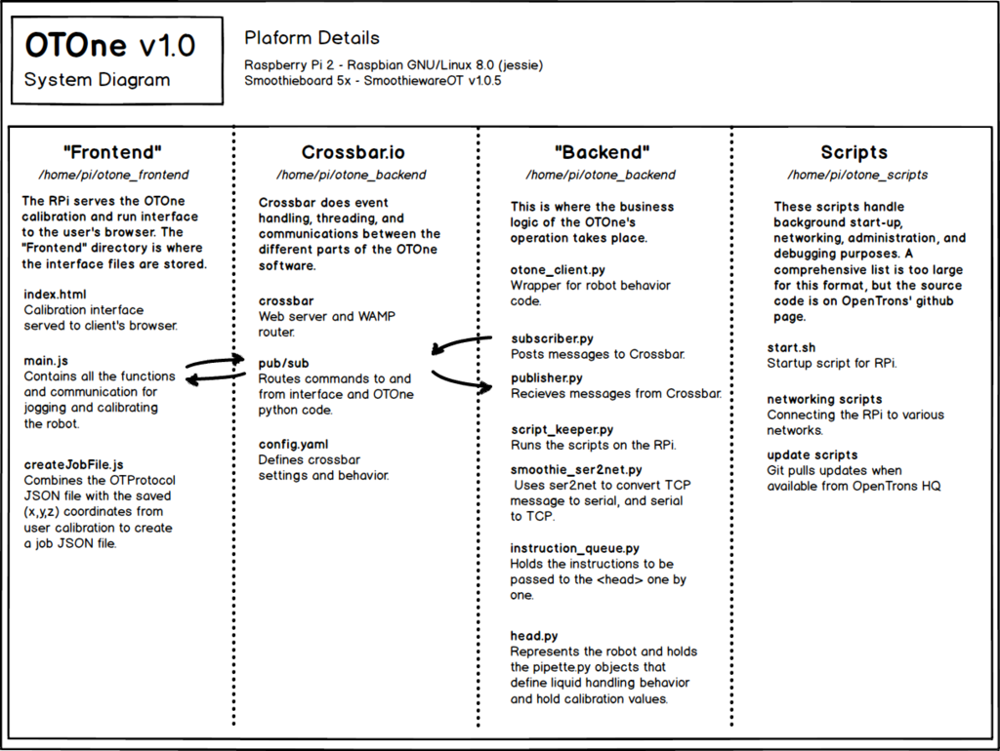

# OpenTrons Protocol Framework 1.0

OpenTrons is placed at the intersection of personal rapid prototyping machines and wet lab biology. 

The proliferation of desktop 3D printers and CNC mills set in motion by the Maker movement has made 3-axis robotics a hackable platform. Whereas five years ago you needed a team of in-house engineers to build a sophisticated 5 axis stepper motor driver, thanks to the Smoothieware community (and others like TinyG) these industrial grade drivers are now affordable and readily avaiable off-the-shelf. The OT.One is made possible by this shift in the technological landscape. In the last year we have built the most affordable possible lab robot using open-source and off-the-shelf parts sourced directly from Shenzhen. 

The software running OT.One is also based upon an open-source foundation following the rapid-prototyping paradigm. By rapid prototyping paradigm, or digital fabrication workflow, I mean enabling a workflow looks something like this:
Design object using CAD -> Prepair or 'Slice' object using CAM -> 'Print' object on machine. 

Each arrow indicates a static file being passed from one software program to another. Often, an STL or OBJ will go to the ReplicatorG, Makerware, Easle, etc to be sliced into a G-code file, which will go to the 3D printer or CNC to get made. 
This workflow has transformed design processes that have been based on making prototypes by hand for most of history. Product development can shift focus more on design and less on prototoype building when 3D printers do what sculptors once did. And when physical products are represented digitally, the development process can leverage software tools that help manage complexity and foster collaboration. 
As a rapid prototyping platform for wet lab protocols, OT.One Protocol Framework 1.0 mirrors the three step 'digital fabrication' pradigm. Download & Design protocol on Mix.Bio -> Calibrate protocol positions -> Run protocol on OT.One.

One important difference between building a 3D printer or CAD machine for physical product design and a robot for wet labs is that CAD programs for biology protocols do not already exist. There are some great companies building various design programs for DNA and metabolic pathways. And though there has been some exciting new work done in that space (Antha) (Autoprotocol), there is not a standard datastructure for an automated liquid handling robot to be built around. So besides designing and manufacturing a liquid handling robot, we've built a lot of the software from scratch. The OpenTrons Protocol Framework 1.0 is the result of over a year of learning and iteration. 

The key piece of this is the OT-Protocol JSON Datastructure. We based it on lessons learned from PRPR and especially Transcriptic Autoprotocol. It is a 'low level' representation of every liquid transfer at the well-to-well level. The current iteration is far from perfect, but does the job for now. 

